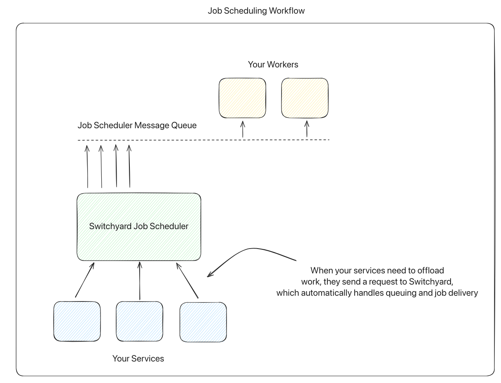
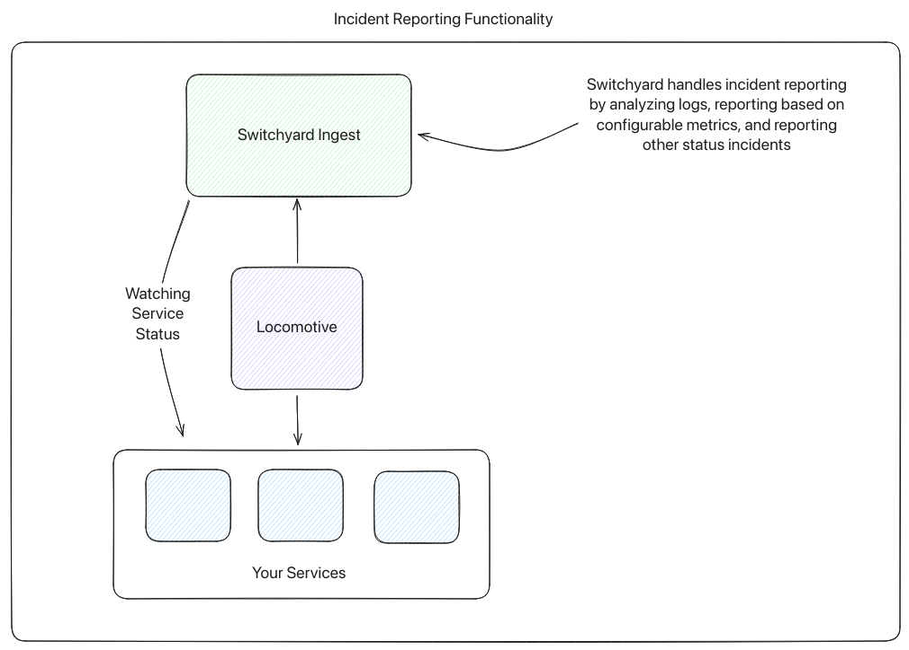
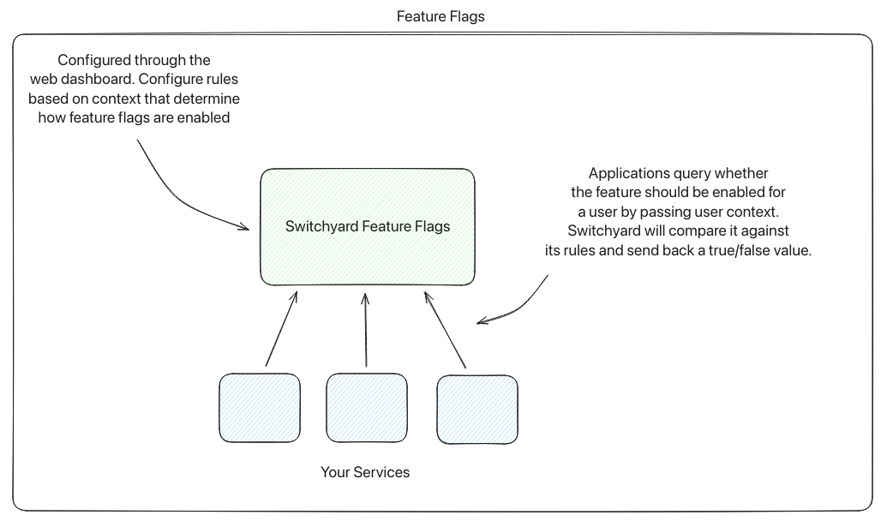

# Switchyard

A plug-and-play Railway template for feature flags, autoscaling, worker scheduling, and observability.

## Overview 📦

- Manage feature flags with simple configuration and robust, contextual rules
- Autoscale services based on custom thresholds
- Offload system work to an autoscaling worker pool with custom job handlers
- Incident detection & reporting. Analysis of logs, metrics, and service statuses

## Architecture ☁️

### Job Scheduling

- As your services need to offload time-consuming work, they can send requests to Switchyard to queue up work
- Switchyard will push work requests onto a queue for workers to process
- You define custom work handlers to process jobs, deployed as normal Railway services
- Switchyard automatically handles scaling by analyzing worker load and job requests
    - NOTE: Switchyard uses the same aforementioned scaling algorithm to determine how to scale workers.

#### A note on autoscaling

- Switchyard's job scheduler also exposes support for general service autoscaling functionality: 
    - Configure services for Switchyard to watch
    - Set autoscaling thresholds for Switchyard to scale by
        - Switchyard uses a robust algorithm for handling normal usage, spiked usage, and sustained high usage
    - Switchyard will automatically up and downscale your service replicas in Railway

#### Worker Considerations

- Your workers must use manual message acknowledgement, due to how Switchyard declares queues to ensure quality of service.
- Switchyard exposes an option that lets you set how many messages each worker can process at once.
- Workers will pull directly from the message bus under the `jobs` topic, containing a `job_id` and `job_context` field.
    - The job context is information provided directly from the host app with context for the worker to perform an action.
    - The job ID is used by both the worker and the scheduler to ensure job idempotency.
- The worked should directly check the Redis cache with the provided job ID to ensure that it has not already been processed before.

Find some example worker code [below.](#example-worker)



### Incident Reporting

- Switchyard automatically watches and processes logs from your service
    - Based on metrics like resource usage, service status, error log frequency, and other configurable metrics, Shipyard can report incidents to an external source
- Your services are also monitored to watch for interesting status changes
- Switchyard forwards incident reports to a custom webhook ingest URL



### Feature Flags

- In the dashboard, create new feature flags
- Define custom rules based on user context to determine how the feature is enabled conditionally
    - e.g., certain user groups/roles, a percentage of users, etc.
- Your services can request the Switchyard service with the user context and determine which path to take



### Platform Observability

- The template also deploys a Prometheus + Grafana instance to handle Switchyard's internal service insights and metrics

## One-Click Deploy 📥

- Deploy on Railway in one click:

## Developing Locally 🧪

- Before deploying on Railway, you can use `docker-compose` to run Switchyard locally, alongside your app

```
git clone https://github.com/ferretcode/switchyard.git
cd switchyard
docker compose up --build
```

Then:

- Access the frontend at http://localhost:3002
- Make web requests to Switchyard in your app
- Test out job scheduling
    - Autoscaling is a no-op action in local development.
- Configure feature flags
- Identify failure points

## example-worker
